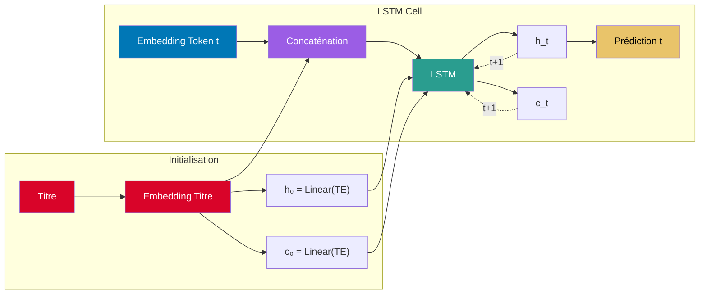

## Architecture du Modèle avec Récurrence

1. **Initialisation**
   - Le titre est transformé en embedding
   - Les états initiaux h₀ et c₀ sont calculés à partir de l'embedding du titre

2. **LSTM Cell Récurrente**
   - À chaque pas de temps t :
     * L'embedding du token courant est concaténé avec l'embedding du titre
     * Le LSTM utilise les états précédents (h_t-1, c_t-1)
     * Génère les nouveaux états (h_t, c_t)
     * Produit la prédiction pour le token t
   - Les états sont réutilisés au pas de temps suivant (t+1)
   - La mémoire à long terme est maintenue via c_t 